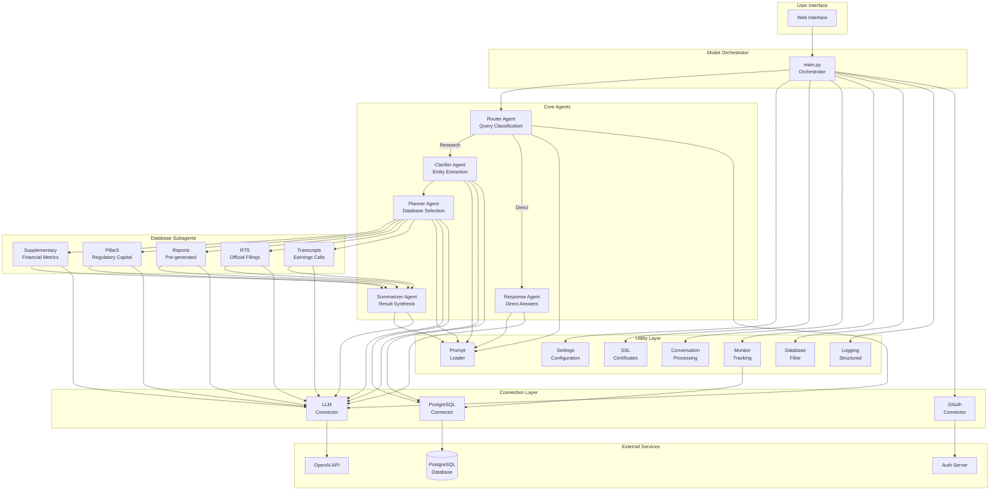

# Aegis AI Financial Assistant - Complete System Documentation

## Executive Summary

Aegis is an AI-powered financial assistant system designed for RBC's CFO Group. It orchestrates multiple specialized agents to process natural language queries about financial data, retrieving information from various databases and synthesizing comprehensive responses. The system uses a sophisticated streaming pipeline with concurrent execution, real-time monitoring, and graceful error handling.

## System Architecture

### High-Level Architecture Diagram



### Module Dependency Hierarchy

```
aegis/
├── model/                    # Orchestration Layer
│   ├── main.py              # Main workflow orchestrator
│   ├── agents/              # Core workflow agents
│   │   ├── router.py        # Binary routing decision
│   │   ├── clarifier.py     # Entity and period extraction
│   │   ├── planner.py       # Database selection logic
│   │   ├── response.py      # Direct response generation
│   │   └── summarizer.py    # Multi-source synthesis
│   ├── subagents/           # Database retrieval agents
│   │   ├── supplementary/    # Financial metrics
│   │   ├── pillar3/         # Regulatory capital data
│   │   ├── reports/         # Pre-generated reports
│   │   ├── rts/            # Official filings
│   │   └── transcripts/     # Earnings calls
│   └── prompts/             # Prompt templates
│       ├── global/          # Shared contexts
│       ├── aegis/           # Agent prompts
│       └── [database]/      # Subagent prompts
├── etls/                    # ETL Layer (Direct Data Access)
│   ├── call_summary/        # Transcript summary ETL
│   │   └── main.py          # Command-line ETL script
│   └── etl_explanation.html # Flow diagram documentation
├── connections/             # External Service Layer
│   ├── oauth_connector.py   # Authentication
│   ├── llm_connector.py     # OpenAI API
│   └── postgres_connector.py # Database access
└── utils/                   # Foundation Layer
    ├── settings.py          # Configuration management
    ├── ssl.py              # SSL certificates
    ├── logging.py          # Structured logging
    ├── conversation.py     # Message processing
    ├── database_filter.py  # Database filtering
    ├── prompt_loader.py    # Prompt composition
    └── monitor.py          # Execution tracking
```

## Complete Workflow: Query to Response

### 1. Request Initialization (main.py)
```python
execution_id = uuid.uuid4()  # Unique request ID
initialize_monitor(execution_id, "aegis")  # Start tracking
```

### 2. Infrastructure Setup
- **SSL Configuration**: Load certificates for secure API calls
- **Authentication**: OAuth token or API key setup
- **Conversation Processing**: Validate and filter messages
- **Database Filtering**: Apply availability constraints

### 3. Query Routing (Router Agent)
```python
route = route_query(conversation, latest_message, context)
# Returns: "direct_response" or "research_workflow"
```

### 4A. Direct Response Path
For greetings, definitions, reformatting:
```python
for chunk in generate_response(...):
    yield {"type": "agent", "name": "aegis", "content": chunk}
```

### 4B. Research Workflow Path

#### Step 1: Clarification (Clarifier Agent)
```python
result = clarify_query(query, context, available_databases, messages)
# Returns: List[bank_period_combinations] or clarification_request
```

#### Step 2: Planning (Planner Agent)
```python
plan = plan_database_queries(clarifier_results, context, available_databases)
# Returns: {"databases": ["supplementary", "rts"], ...}
```

#### Step 3: Concurrent Retrieval (Subagents)
```python
for database_id in databases:
    thread = Thread(target=run_subagent, args=(database_id, queue))
    thread.start()
# Streams results as they arrive
```

#### Step 4: Synthesis (Summarizer Agent)
```python
for chunk in synthesize_responses(conversation, latest_message, database_responses):
    yield {"type": "agent", "name": "aegis", "content": chunk}
```

### 5. Monitoring & Completion
```python
post_monitor_entries(execution_id)  # Save to database
```

## Module Specifications

### Model Module (Orchestration Layer)
**Location**: `src/aegis/model/`
**Purpose**: Orchestrates the entire workflow from request to response
**Key Components**:
- **main.py**: Central orchestrator with streaming pipeline
- **agents/**: Core workflow agents for routing, clarification, planning, response, and synthesis
- **subagents/**: Database-specific retrieval agents
- **prompts/**: Hierarchical prompt templates

[See detailed documentation: src/aegis/model/CLAUDE.md]

### Connections Module (External Service Layer)
**Location**: `src/aegis/connections/`
**Purpose**: Manages all external service integrations
**Key Components**:
- **oauth_connector**: OAuth 2.0 and API key authentication
- **llm_connector**: OpenAI API with model tiers, streaming, embeddings
- **postgres_connector**: Database operations with connection pooling

[See detailed documentation: src/aegis/connections/CLAUDE.md]

### Utils Module (Foundation Layer)
**Location**: `src/aegis/utils/`
**Purpose**: Provides core utilities and infrastructure
**Key Components**:
- **settings**: Singleton configuration management
- **logging**: Structured logging with colors
- **ssl**: Certificate configuration
- **conversation**: Message validation and filtering
- **database_filter**: Database availability management
- **prompt_loader**: Prompt composition system
- **monitor**: Workflow execution tracking

[See detailed documentation: src/aegis/utils/CLAUDE.md]

### Agents Module (Intelligence Layer)
**Location**: `src/aegis/model/agents/`
**Purpose**: Implements core decision-making logic
**Key Agents**:
- **Router**: Binary classification (direct vs research)
- **Clarifier**: Bank/period extraction with intent
- **Planner**: Database selection with pairing rules
- **Response**: Direct answers without data
- **Summarizer**: Multi-source synthesis

[See detailed documentation: src/aegis/model/agents/CLAUDE.md]

### Subagents Module (Data Retrieval Layer)
**Location**: `src/aegis/model/subagents/`
**Purpose**: Database-specific data retrieval
**Key Subagents**:
- **supplementary**: Financial metrics and comparisons
- **pillar3**: Basel III regulatory capital data
- **reports**: Pre-generated analysis reports
- **rts**: Official regulatory filings
- **transcripts**: Earnings call content

[See detailed documentation: src/aegis/model/subagents/CLAUDE.md]

### Prompts Module (Knowledge Layer)
**Location**: `src/aegis/model/prompts/`
**Purpose**: Structured prompt templates and contexts
**Structure**:
- **global/**: Shared contexts (fiscal, project, database, restrictions)
- **aegis/**: Main agent prompts
- **[database]/**: Subagent-specific prompts

[See detailed documentation: src/aegis/model/prompts/CLAUDE.md]

### ETL Module (Direct Access Layer)
**Location**: `src/aegis/etls/`
**Purpose**: Provides direct access to subagent functions for predetermined workflows
**Key Features**:
- **Direct Function Access**: Bypasses Router, Clarifier, and Planner agents
- **Command-Line Interface**: Structured parameters instead of natural language
- **Custom Prompt Injection**: ETL-specific prompts for targeted extraction
- **80% LLM Reduction**: Only 1 LLM call vs 5 in conversational flow
- **Report Generation**: Creates reports stored in database for Aegis retrieval

**Call Summary ETL Example**:
```bash
python -m aegis.etls.call_summary.main \
  --bank "Royal Bank of Canada" \
  --year 2024 \
  --quarter Q3 \
  --query "Extract all revenue metrics and growth rates"
```

**Architecture Benefits**:
- **Efficiency**: Skips method selection LLM, uses predetermined retrieval method
- **Customization**: Injects custom prompts overriding default synthesis
- **Integration**: Generated reports accessible via Aegis Reports subagent
- **Performance**: Ideal for batch processing and scheduled report generation

[See flow comparison: src/aegis/etls/etl_explanation.html]

## Key Design Patterns

### 1. Streaming Architecture
All components use generator functions for real-time streaming:
```python
def agent() -> Generator[Dict[str, str], None, None]:
    yield {"type": "agent", "name": "aegis", "content": "..."}
```

### 2. Context Propagation
Runtime context flows through all layers:
```python
context = {
    "execution_id": uuid,
    "auth_config": {...},
    "ssl_config": {...}
}
```

### 3. Unified Message Schema
Consistent message format throughout:
```python
{
    "type": "agent" | "subagent",
    "name": str,  # Source identifier
    "content": str  # Text content
}
```

### 4. Monitoring Integration
Every stage records metrics:
```python
add_monitor_entry(
    stage_name="Stage_Name",
    stage_start_time=start,
    stage_end_time=end,
    status="Success",
    decision_details="...",
    llm_calls=[...]
)
```

### 5. Error Handling Strategy
Graceful degradation with user feedback:
```python
try:
    # Operation
except Exception as e:
    logger.error(...)
    yield {"content": f"⚠️ Error: {e}"}
```

## Configuration Management

### Environment Variables
All configuration via `.env` file:
```bash
# Core
LOG_LEVEL=INFO
ENVIRONMENT=production

# Authentication
AUTH_METHOD=oauth|api_key
API_KEY=...
OAUTH_ENDPOINT=...

# Database
POSTGRES_HOST=localhost
POSTGRES_PORT=5432

# LLM Models
LLM_MODEL_SMALL=gpt-4.1-nano-2025-04-14
LLM_MODEL_MEDIUM=gpt-4.1-mini-2025-04-14
LLM_MODEL_LARGE=gpt-4.1-2025-04-14
```

### Configuration Access
```python
from aegis.utils.settings import config

# Singleton access
api_key = config.api_key
model = config.llm.medium.model
```

## Database Schema

### aegis_data_availability
Banks and period coverage:
```sql
CREATE TABLE aegis_data_availability (
    bank_id INTEGER,
    bank_name VARCHAR,
    bank_symbol VARCHAR,
    fiscal_year INTEGER,
    quarter VARCHAR,
    database_names TEXT[]
);
```

### process_monitor_logs
Workflow execution tracking:
```sql
CREATE TABLE process_monitor_logs (
    log_id SERIAL PRIMARY KEY,
    run_uuid UUID,
    model_name VARCHAR,
    stage_name VARCHAR,
    stage_start_time TIMESTAMP,
    stage_end_time TIMESTAMP,
    duration_ms INTEGER,
    status VARCHAR,
    decision_details TEXT,
    error_message TEXT,
    custom_metadata JSONB,
    total_tokens INTEGER,
    total_cost NUMERIC
);
```

## Development Standards

### Code Quality Requirements
- **Pylint**: 10.00/10 score required
- **Black**: Format with line-length 100
- **Flake8**: Zero warnings allowed
- **Type Hints**: All functions annotated
- **Docstrings**: Google style required
- **Tests**: >90% coverage on business logic

### Testing Strategy
```bash
# Activate virtual environment
source venv/bin/activate

# Run tests
python -m pytest tests/aegis/ -xvs

# Check coverage
python -m pytest tests/aegis/ --cov=aegis --cov-report=html

# Code quality
black src/ --line-length 100
flake8 src/ --max-line-length 100
pylint src/
```

### Virtual Environment
**ALWAYS use virtual environment**:
```bash
source venv/bin/activate
python -m pip install -r requirements.txt
```

## Implementation Status

### ✅ Fully Implemented
- **Infrastructure**: All utilities and connectors
- **Orchestration**: Main workflow pipeline
- **Agents**: Router, Clarifier, Planner, Response, Summarizer
- **Subagents**: All 5 database agents (placeholder mode)
- **ETL System**: Direct access layer for batch processing
- **Monitoring**: Complete execution tracking
- **Testing**: 117 tests, 93% coverage

### 🚧 In Development
- **Real Data Integration**: Replace placeholder subagents
- **Caching Layer**: Query result caching
- **Advanced Routing**: Multi-class routing
- **WebSocket Support**: Real-time bidirectional streaming

## Quick Start Guide

### 1. Environment Setup
```bash
# Clone repository
git clone <repository>
cd aegis

# Create virtual environment
python -m venv venv
source venv/bin/activate

# Install dependencies
pip install -r requirements.txt

# Configure environment
cp .env.example .env
# Edit .env with your settings
```

### 2. Database Setup
```bash
# Verify connection to hosted database
python scripts/database_validator.py --status
```

### 3. Run Application
```bash
# Start FastAPI web interface with WebSocket support
python run_fastapi.py

# Or use programmatically
python
>>> from aegis.model.main import model
>>> msgs = [{"role": "user", "content": "What is RBC's Q3 revenue?"}]
>>> for chunk in model({"messages": msgs}):
...     print(chunk["content"], end="")
```

## API Reference

### Main Entry Point
```python
from aegis.model.main import model

def model(
    conversation: Union[Dict, List],
    db_names: Optional[List[str]] = None
) -> Generator[Dict[str, str], None, None]:
    """Stream responses for user queries."""
```

### Message Format
```python
# Input
conversation = {
    "messages": [
        {"role": "user", "content": "query text"}
    ]
}

# Output
yield {
    "type": "agent" | "subagent",
    "name": "source_identifier",
    "content": "response text"
}
```

## Troubleshooting

### Common Issues

#### Import Errors
```bash
# Clear Python cache
find . -type d -name __pycache__ -exec rm -rf {} + 2>/dev/null
rm -rf .pytest_cache/
```

#### Authentication Failures
- Verify AUTH_METHOD in .env
- Check API_KEY or OAuth credentials
- Ensure SSL_CERT_PATH is valid

#### Database Connection Issues
- Verify PostgreSQL is running
- Check POSTGRES_* environment variables
- Ensure aegis_data_availability table exists

#### LLM API Errors
- Check API quota and limits
- Verify model names are current
- Review token usage in monitoring

## Contributing Guidelines

### Code Submission
1. Create feature branch
2. Write tests first (TDD)
3. Implement feature
4. Run quality checks
5. Update documentation
6. Submit pull request

### Quality Checklist
- [ ] Tests pass (100%)
- [ ] Black formatted
- [ ] Flake8 clean
- [ ] Pylint 10.00/10
- [ ] Type hints complete
- [ ] Docstrings added
- [ ] CLAUDE.md updated

## Support & Resources

### Documentation
- Module docs: `src/aegis/*/CLAUDE.md`
- API docs: `docs/api/`
- Examples: `examples/`

### Contact
- Issues: GitHub Issues
- Internal: RBC CFO Group IT Support

---

# Original Project Code Standards

## Python Virtual Environment

**IMPORTANT: Always use the virtual environment for all Python operations:**

```bash
# Activate virtual environment before any Python commands
source venv/bin/activate

# All Python commands should be run with the venv activated:
python -m pytest tests/
python -m pip install <package>
black src/ --line-length 100
flake8 src/ --max-line-length 100
pylint src/
```

## Cache Management

Regularly clear Python cache folders to avoid stale bytecode issues:

```bash
# Clear all __pycache__ directories
find . -type d -name __pycache__ -exec rm -rf {} + 2>/dev/null

# Clear pytest cache
rm -rf .pytest_cache/

# Clear any .pyc files
find . -type f -name "*.pyc" -delete
```

Run cache cleanup when:
- Experiencing import errors or strange behavior
- After major refactoring
- Before running tests after significant changes

## Code Style and Formatting

All Python code in this project must adhere to the following standards:

### Formatting Tools
- **Black**: Code formatter with line length of 100
- **Flake8**: Style guide enforcement
- **Pylint**: Code analysis for errors and standards

Run these before committing any code:
```bash
black src/ --line-length 100
flake8 src/ --max-line-length 100
pylint src/
```

### Documentation Standards

#### Module Docstrings
Every Python file should start with a module docstring:
```python
"""
Module description explaining what this module does.

This module handles X functionality for the Y system.
"""
```

#### Function Docstrings
All functions must have docstrings following Google style:
```python
def function_name(param1: str, param2: int) -> dict:
    """
    Brief description of what the function does.
    
    Longer description if needed, explaining details about
    the function's behavior, assumptions, or important notes.
    
    Args:
        param1: Description of param1
        param2: Description of param2
        
    Returns:
        Description of what is returned
        
    Raises:
        ExceptionType: When this exception is raised
    """
```

#### Class Docstrings
Classes should have docstrings explaining their purpose:
```python
class ClassName:
    """
    Brief description of the class purpose.
    
    Longer description if needed.
    
    Attributes:
        attribute1: Description of attribute1
        attribute2: Description of attribute2
    """
```

### Type Hints
- All function parameters and return values must have type hints
- Use `from typing import` for complex types (Optional, Dict, List, etc.)

### Comments
- Use inline comments sparingly and only when the code isn't self-explanatory
- Comments should explain "why" not "what"
- Keep comments up-to-date with code changes

### Import Order
Follow PEP 8 import ordering:
1. Standard library imports
2. Related third party imports
3. Local application imports

Each group separated by a blank line.

### Constants
- Define constants at module level in UPPER_CASE
- Group related constants together with a comment header

### Error Handling
- Use specific exception types
- Document raised exceptions in docstrings
- Log errors appropriately using the configured logger

## Project-Specific Standards

### Logging
- Always use the configured logger from `aegis.utils.logging`
- Include execution_id in workflow-related logs
- Use appropriate log levels (DEBUG, INFO, WARNING, ERROR, CRITICAL)

### Configuration
- All environment variables must be accessed through `aegis.utils.settings.config`
- Never hardcode sensitive values
- Document new environment variables in `.env.example`

### Testing
- Write tests for all new functionality
- Place tests in `tests/aegis/` mirroring the source structure
- Use descriptive test names that explain what is being tested
- Shared fixtures are defined in `tests/conftest.py`
- Avoid test duplication - use parametrized tests where possible

## Pre-Commit Checklist
Before committing code, ensure:
- [ ] Black formatting applied
- [ ] Flake8 passes with no warnings
- [ ] Pylint score is acceptable (>8.0)
- [ ] All functions have docstrings
- [ ] Type hints are present
- [ ] Tests are written and passing
- [ ] No hardcoded secrets or credentials

## Aegis Project Architecture

### Core Components

#### 1. Workflow Orchestration (`src/aegis/model/workflow/`)
- **execute_workflow()**: Main entry point for processing conversations
- Generates unique UUID execution_id for request tracking
- Returns bundled response with execution_id, ssl_config, and processed_conversation

#### 2. Conversation Processing (`src/aegis/utils/conversation/`)
- **process_conversation()**: Validates and filters incoming messages
- Processing steps:
  1. Validates message structure (role and content required)
  2. Filters by role based on ALLOWED_ROLES environment variable
  3. Removes system messages if INCLUDE_SYSTEM_MESSAGES=false
  4. Trims to MAX_HISTORY_LENGTH most recent messages (default: 10)
  5. Returns processed messages with metadata and latest_message
- **Note**: `latest_message` is the chronologically last message after all filtering/trimming, regardless of role (could be user, assistant, or system if included)

#### 3. SSL Configuration (`src/aegis/utils/ssl/`)
- **setup_ssl()**: Returns SSL configuration for API calls
- Returns: `{"verify": bool, "cert_path": str|None}`
- Used by OAuth and LLM connectors for HTTPS requests
- Configured via SSL_VERIFY and SSL_CERT_PATH environment variables

#### 4. Logging System (`src/aegis/utils/logging/`)
- **setup_logging()**: Configures colored console output with structlog
- **get_logger()**: Returns logger instance with contextual logging
- Log levels with icons: 🔍 DEBUG, ✓ INFO, ⚠ WARNING, ✗ ERROR, 🔥 CRITICAL
- Always log with execution_id for request tracking

#### 5. Configuration Management (`src/aegis/utils/settings/`)
- **Config**: Singleton class loading from .env file
- All environment variables accessed through `config` object
- Never access os.getenv() directly, use `config.variable_name`

### Environment Variables
The following environment variables control application behavior:

```bash
# Logging
LOG_LEVEL=INFO  # DEBUG, INFO, WARNING, ERROR, CRITICAL

# Conversation Processing
INCLUDE_SYSTEM_MESSAGES=false  # Include/exclude system role messages
ALLOWED_ROLES=user,assistant   # Comma-separated list of allowed roles
MAX_HISTORY_LENGTH=10          # Number of recent messages to keep

# SSL Configuration
SSL_VERIFY=false                                    # Enable/disable SSL verification
SSL_CERT_PATH=src/aegis/utils/ssl/rbc-ca-bundle.cer  # Path to certificate file

# Authentication (see .env.example for full configuration)
AUTH_METHOD=api_key  # or oauth
API_KEY=your_api_key  # For api_key method
OAUTH_ENDPOINT=https://...  # For oauth method
OAUTH_CLIENT_ID=...  # For oauth method
OAUTH_CLIENT_SECRET=...  # For oauth method

# Database Configuration
POSTGRES_HOST=localhost
POSTGRES_PORT=5432
POSTGRES_DATABASE=your_db
POSTGRES_USER=your_user
POSTGRES_PASSWORD=your_password
```

### Testing Standards
- Use pytest for all tests
- Place tests in `tests/aegis/` mirroring source structure
- Focus on business logic, not excessive validation testing
- Use parametrized tests to reduce redundancy
- Aim for >90% coverage on business logic
- Common fixtures (config reset, sample data) in `tests/conftest.py`
- Each test should be isolated and not depend on execution order

### LLM Connector API Pattern

The LLM connector uses a clean context-based API pattern:

```python
# Create context dictionary
context = {
    "execution_id": execution_id,
    "auth_config": auth_config,  # From setup_authentication()
    "ssl_config": ssl_config      # From setup_ssl()
}

# Optional LLM parameters (defaults to config if not specified)
llm_params = {
    "model": "gpt-4.1-mini-2025-04-14",  # Optional, defaults per function
    "temperature": 0.7,                   # Optional
    "max_tokens": 2000                    # Optional
}

# Available functions
result = check_connection(context)  # Verify LLM connectivity
response = complete(messages, context, llm_params, model_tier="medium")  # Standard completion
for chunk in stream(messages, context, llm_params):  # Streaming response
    print(chunk)
response = complete_with_tools(messages, tools, context, llm_params)  # Function calling
embeddings = create_embedding(texts, context, llm_params)  # Text embeddings
```

### Code Quality Standards

This project maintains perfect code quality:
- **Pylint**: 10.00/10 score (no disabled warnings)
- **Black**: Properly formatted with line-length 100
- **Flake8**: Zero warnings or errors
- **Tests**: 100% passing (117 tests)
- **Coverage**: 93% overall (100% on core business logic)

### Implementation Status

#### Fully Implemented Components
- **Connectors**: 
  - OAuth Connector (OAuth 2.0 client credentials flow)
  - LLM Connector (OpenAI API with 3 model tiers + embeddings)
  - Postgres Connector (SQLAlchemy with connection pooling)
- **Utils**:
  - Logging (structlog with colored output and execution tracking)
  - SSL Configuration (certificate verification support)
  - Conversation Processing (message validation, filtering, trimming)
  - Settings Management (singleton config with .env support)
  - Process Monitoring (database tracking of workflow stages)
- **Workflow**: Main orchestration with monitoring integration
- **Testing**: 117 tests with 93% coverage, shared fixtures in conftest.py

#### Future Components (Not Yet Implemented)
- **Agents**: Router, Clarifier, Planner, Response, Summarizer
- **Subagents**: Supplementary, Reports, RTS, Transcripts  
- **Global Prompts**: Database, Fiscal, Project, Restrictions context

#### Known Test Organization Issues
- Some tests exist outside `tests/aegis/` directory (should be consolidated)
- `test_workflow.py` and `test_workflow_monitoring.py` have overlapping coverage
- Recommendation: Merge workflow monitoring tests into main workflow test file